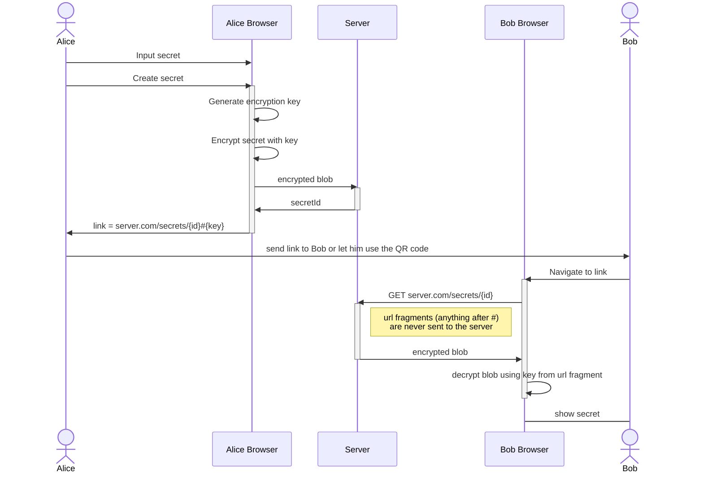

# quick-share

Simple secrets sharing app with E2EE. The server only ever sees an encrypted
blob of data. The server does not have the key to decrypt the data. The key is
only shared with the recipient of the secret.

## Usage

Deploy the server:

```bash
$ docker run -d -p 8888:80 --name quick-share ghcr.io/simonschneider/quick-share
```

or use the docker-compose file:

```bash
$ docker-compose up -d
```

or you can build the binary yourself and just use that (the binary embeds all static files to be selfcontained and does not need any other files):

```bash
$ go build -o quick-share *.go
```

Navigate to the page in your browser and start sharing secrets.

## Details


