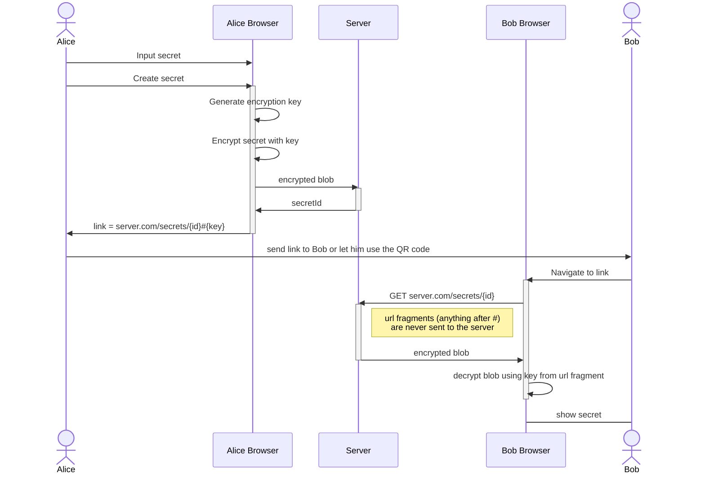

# quick-share

Simple secrets sharing app. End-to-end encrypted. The server only ever sees an encrypted
blob of data. The server does not have the key to decrypt the data.

## Usage

Deploy the server:

```bash
$ docker run -d -p 8080:8080 --name quick-share-server ghcr.io/quick-share/quick-share-server
```

Navigate to the page in your browser and start sharing secrets.

## Details



## More Features

- [ ] Allow uploading files
- [ ] Allow setting a password for the secret in addition to the encryption key. This would allow the secret to be shared even more securely by sharing the password over a different channel (ie. voice) and only allowing the link to be a one time use.